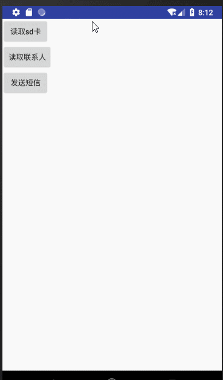

## 权限申请库

```
implementation 'tech.liujin:permission:1.0.0'
```

## 使用

请求

```
PermissionFragment.request(
    this,
    permission.WRITE_EXTERNAL_STORAGE,
    new OnRequestPermissionResultListener() {
          @Override
          public void onResult (
              String permission, 
              boolean success,
              boolean isFinalResult ) {
               
          }
    }
);
```

或者

```
PermissionActivity.requestPermission(
    this, 
    permission.SEND_SMS,
    new OnRequestPermissionResultListener() {
          @Override
          public void onResult (
              String permission, 
              boolean success,
              boolean isFinalResult ) {
               
          }
    }
);
```



